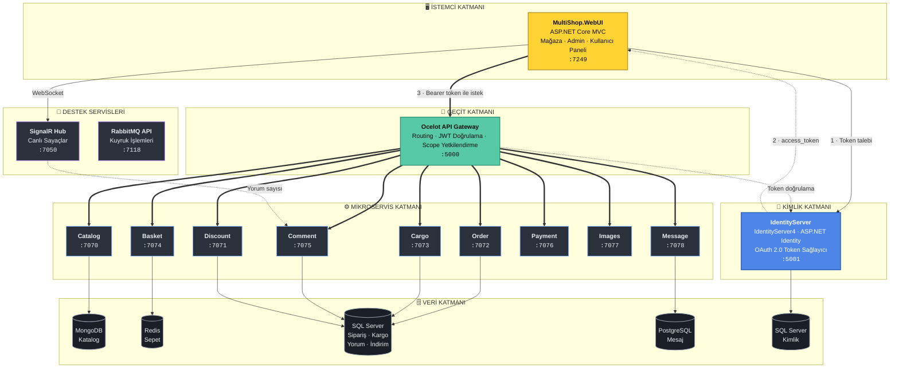
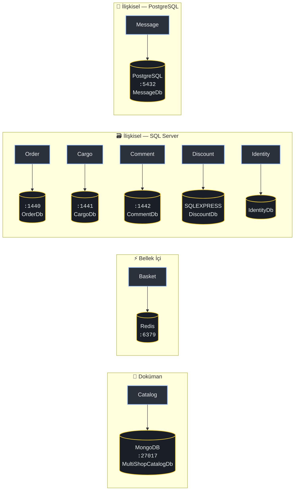
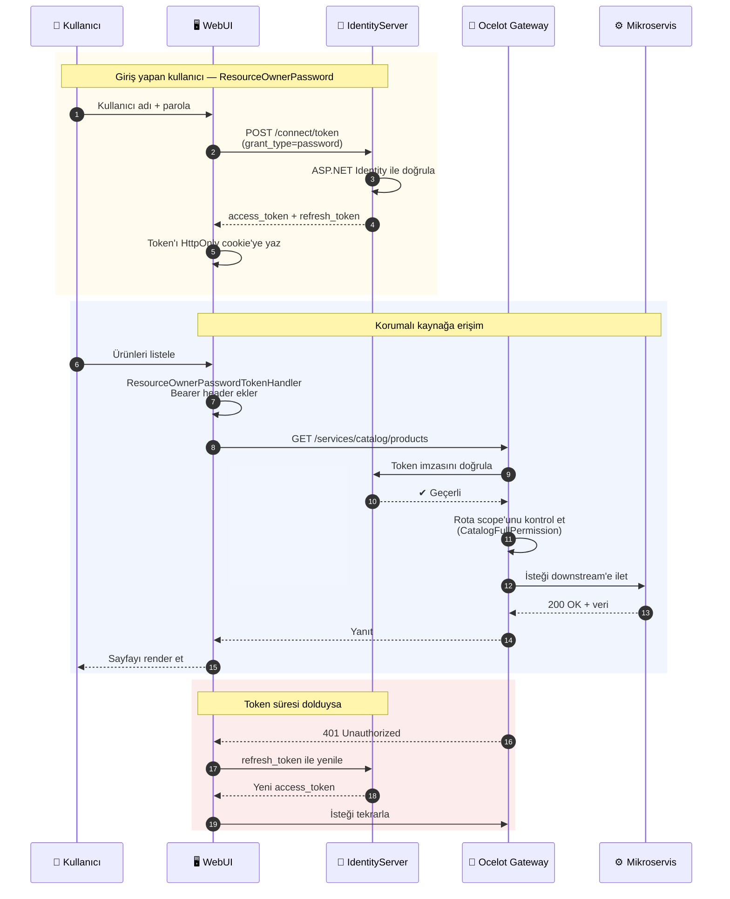
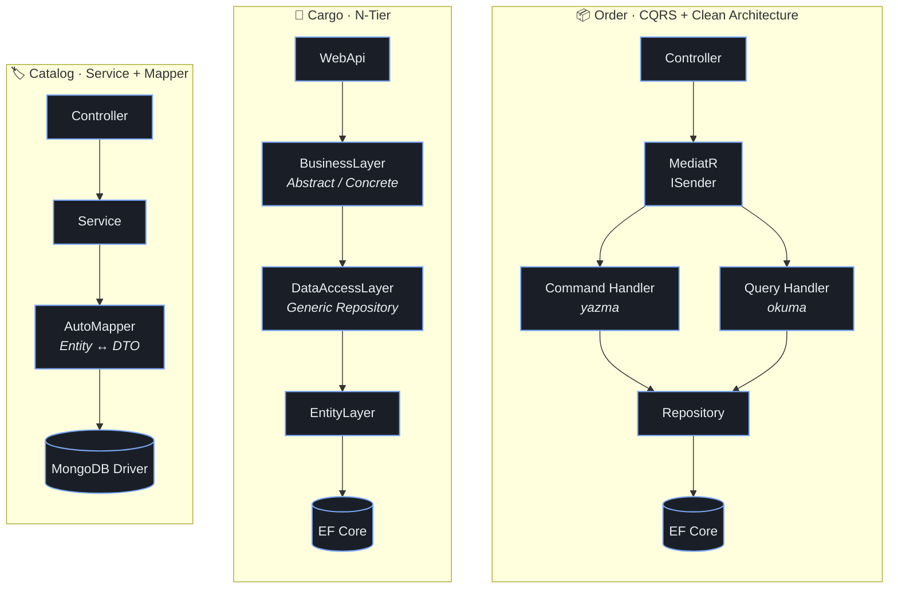
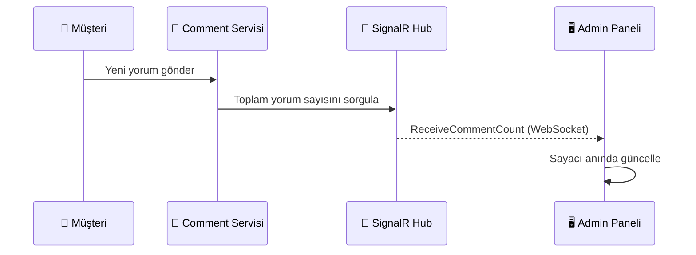
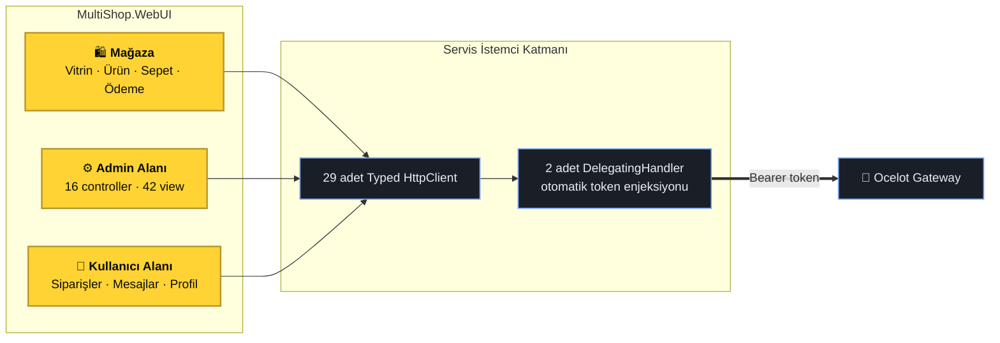

<div align="center">

# 🛒 MultiShop

**.NET tabanlı, mikroservis mimarisiyle geliştirilmiş uçtan uca e-ticaret platformu**

Her servis kendi veri yönetiminden sorumludur ve ihtiyaçlarına göre bağımsız veri depolama yaklaşımı kullanır. Merkezi bir API Gateway üzerinden
OAuth 2.0 ile korunur.

<br/>


<br/>


</div>

---

## 📑 İçindekiler

| | |
|---|---|
| [Proje Hakkında](#-proje-hakkında) | [Mimari Desenler](#-mimari-desenler) |
| [Sistem Mimarisi](#-sistem-mimarisi) | [Gerçek Zamanlı ve Mesajlaşma](#-gerçek-zamanlı-ve-mesajlaşma) |
| [Mikroservisler](#-mikroservisler) | [Frontend Katmanı](#-frontend-katmanı) |
| [Veri Katmanı](#-veri-katmanı--polyglot-persistence) | [Teknoloji Yığını](#-teknoloji-yığını) |
| [Kimlik Doğrulama](#-kimlik-doğrulama-ve-yetkilendirme) | [Proje Yapısı](#-proje-yapısı) |

---

## 🎯 Proje Hakkında

MultiShop, monolitik bir e-ticaret uygulamasının mikroservislere bölündüğünde nasıl görüneceğini
uçtan uca gösteren bir referans projedir. Amaç yalnızca "servisleri parçalamak" değil, her servisin
**kendi probleminin gerektirdiği mimariyi ve veri deposunu** seçmesini göstermektir.

Bu yüzden proje içinde tek bir mimari kalıp yoktur:

- Sipariş servisi karmaşık iş akışı içerdiği için **CQRS + MediatR** ile Clean Architecture kullanır.
- Kargo servisi klasik CRUD ağırlıklı olduğu için **N-Tier (katmanlı)** mimariyle yazılmıştır.
- Katalog servisi şemasız ve okuma yoğun olduğu için **MongoDB** üzerinde çalışır.
- Sepet servisi geçici ve hızlı erişim gerektirdiği için **Redis**'te yaşar.
- İndirim servisi basit ve performans odaklı sorgular içerdiği için **Dapper** kullanır.

---

## 🏗 Sistem Mimarisi

Tüm istemci trafiği tek bir kapıdan (Ocelot Gateway) geçer. Gateway, isteği ilgili servise
yönlendirmeden önce JWT'yi doğrular ve rota bazında **scope** kontrolü yapar.



---

## 🧩 Mikroservisler

Dokuz iş servisi ve iki destek servisi bulunur. Her biri bağımsız olarak derlenir, çalışır ve
kendi veri deposuna sahiptir — servisler arasında doğrudan veritabanı paylaşımı yoktur.

| Servis | Port | Mimari Deseni | Veri Deposu | ORM / Erişim | .NET |
|:---|:---:|:---|:---|:---|:---:|
| 🏷️ **Catalog** | `7070` | Service + AutoMapper | MongoDB | MongoDB.Driver | 6.0 |
| 🎟️ **Discount** | `7071` | Service + Micro-ORM | SQL Server | **Dapper** | 6.0 |
| 📦 **Order** | `7072` | **CQRS + MediatR** / Clean Arch. | SQL Server | EF Core | 6.0 |
| 🚚 **Cargo** | `7073` | **N-Tier** (5 katman) | SQL Server | EF Core + Repository | 6.0 |
| 🛒 **Basket** | `7074` | Service | **Redis** | StackExchange.Redis | 6.0 |
| 💬 **Comment** | `7075` | Service | SQL Server | EF Core | 8.0 |
| 💳 **Payment** | `7076` | Service | — | — | 8.0 |
| 🖼️ **Images** | `7077` | Service | Dosya sistemi | — | 8.0 |
| ✉️ **Message** | `7078` | Service + AutoMapper | **PostgreSQL** | EF Core + Npgsql | 8.0 |
| 📡 **SignalR** | `7050` | Hub | — | — | 8.0 |
| 🐇 **RabbitMQ** | `7118` | Producer / Consumer | — | RabbitMQ.Client | 8.0 |

### Servis Detayları

<details>
<summary><b>🏷️ Catalog — Ürün Kataloğu (MongoDB)</b></summary>

<br/>

Mağazanın tüm vitrin verisini tutar. Şema esnekliği ve okuma performansı gerektirdiği için
ilişkisel değil **doküman veritabanı** seçilmiştir.

**11 koleksiyon:** `Products`, `Categories`, `ProductDetails`, `ProductImages`, `Brands`,
`Features`, `FeatureSliders`, `SpecialOffers`, `OfferDiscounts`, `Abouts`, `Contacts`

**12 controller** ile tam CRUD sağlar. Entity ↔ DTO dönüşümleri **AutoMapper** profilleriyle yapılır.

Ayrıca bir `StatisticsController` üzerinden admin paneline toplu metrik sunar:
`GetProductCount`, `GetCategoryCount`, `GetBrandCount`, `GetProductAvgPrice`,
`GetMaxPriceProductName`, `GetMinPriceProductName`

```
MultiShop.Catalog/
├── Controllers/     → 12 API controller
├── Entities/        → MongoDB doküman modelleri
├── Dtos/            → Result / Create / Update / GetById
├── Mapping/         → AutoMapper profilleri
├── Services/        → İş mantığı
└── Settings/        → DatabaseSettings (connection + koleksiyon adları)
```

</details>

<details>
<summary><b>📦 Order — Sipariş Yönetimi (CQRS + MediatR + Clean Architecture)</b></summary>

<br/>

Projedeki en olgun mimariye sahip servis. Okuma ve yazma sorumlulukları **CQRS** ile ayrılmış,
katmanlar **Clean Architecture** prensiplerine göre düzenlenmiştir. Toplam **16 handler** içerir.

```
Services/Order/
├── Core/
│   ├── MultiShop.Order.Domain/          → Entity'ler (bağımlılıksız çekirdek)
│   └── MultiShop.Order.Application/     → CQRS + MediatR
│       ├── Features/CQRS/               → Address & OrderDetail
│       │   ├── Commands/  Queries/
│       │   ├── Handlers/  Results/
│       └── Features/Mediator/           → Ordering (IRequest / IRequestHandler)
├── Infrastructure/
│   └── MultiShop.Order.Persistence/     → EF Core, DbContext, Repository
└── Presentation/
    └── MultiShop.Order.WebApi/          → Controllers (yalnızca MediatR'a delege eder)
```

İki farklı CQRS yaklaşımı bilinçli olarak bir arada gösterilmiştir: `Features/CQRS` klasöründe
el yazımı handler'lar, `Features/Mediator` klasöründe ise MediatR'ın `IRequest` altyapısı.

</details>

<details>
<summary><b>🚚 Cargo — Kargo Takibi (N-Tier / Katmanlı Mimari)</b></summary>

<br/>

CRUD ağırlıklı bir domain olduğu için klasik **beş katmanlı** mimari tercih edilmiştir.
Her katman ayrı bir `.csproj` projesidir.

```
Services/Cargo/
├── MultiShop.Cargo.EntityLayer/       → Domain entity'leri
├── MultiShop.Cargo.DataAccessLayer/   → Abstract / Concrete / EntityFramework / Repositories
├── MultiShop.Cargo.BusinessLayer/     → Abstract / Concrete / ValidationRules / Extensions
├── MultiShop.Cargo.DtoLayer/          → Veri transfer nesneleri
└── MultiShop.Cargo.WebApi/            → API uç noktaları
```

**Controller'lar:** `CargoCompanies`, `CargoCustomers`, `CargoDetails`, `CargoOperations`

Generic Repository deseni ve `ServiceCollection` extension'ları ile bağımlılık kaydı merkezileştirilmiştir.

</details>

<details>
<summary><b>🛒 Basket — Sepet (Redis)</b></summary>

<br/>

Sepet verisi geçicidir ve çok hızlı okunup yazılması gerekir. Bu yüzden ilişkisel veritabanı yerine
**Redis** üzerinde, kullanıcı kimliğine göre anahtarlanmış olarak tutulur.

```
MultiShop.Basket/
├── Controllers/BasketsController.cs
├── Services/
│   ├── RedisService.cs        → Bağlantı yönetimi (StackExchange.Redis)
│   ├── BasketService.cs       → Sepet okuma / yazma / silme
│   └── LoginService.cs        → Token'dan kullanıcı kimliği çözümleme
├── Dtos/  → BasketItemDto, BasketTotalDto
└── Settings/RedisSettings.cs
```

Sepet, JWT içindeki `sub` claim'i ile ilişkilendirilir — yani her kullanıcı yalnızca kendi sepetini görür.

</details>

<details>
<summary><b>🎟️ Discount — İndirim Kuponları (Dapper)</b></summary>

<br/>

Basit ve okuma yoğun sorgular içerdiği için tam ORM yerine **Dapper** micro-ORM kullanılmıştır.
EF Core yalnızca migration üretmek için bulundurulur; çalışma zamanında sorgular ham SQL ile döner.

Kupon kodu doğrulama akışı sepet toplamına indirim oranını uygular ve sonucu WebUI'ye döndürür.

</details>

<details>
<summary><b>✉️ Message — Mesajlaşma (PostgreSQL)</b></summary>

<br/>

Kullanıcı ile yönetim arasındaki mesajlaşmayı yönetir. Projedeki tek **PostgreSQL** servisidir —
farklı bir ilişkisel veritabanının aynı mimaride nasıl yaşayabileceğini göstermek için seçilmiştir.

**Controller'lar:** `UserMessage` (gelen/giden kutusu), `UserMessageStatistics` (okunmamış sayacı)

</details>

<details>
<summary><b>💬 Comment · 💳 Payment · 🖼️ Images</b></summary>

<br/>

**Comment** — Ürün yorumlarını SQL Server üzerinde EF Core ile yönetir. `CommentStatistics`
controller'ı toplam yorum sayısını döner; bu değer SignalR üzerinden admin paneline canlı yansıtılır.

**Payment** — Ödeme adımının iskeletini barındırır. Şu an veri deposu kullanmaz.

**Images** — Ürün görsellerinin sunumundan sorumludur, dosya sistemi üzerinde çalışır.

</details>

---

## 🗄 Veri Katmanı — Polyglot Persistence

Projenin en belirgin mimari kararı: **her servis kendi problemine uygun veri deposunu seçer.**
Tek bir merkezi veritabanı yoktur, servisler birbirinin verisine doğrudan erişemez.



| Veri Deposu | Kullanan Servis | Neden Seçildi |
|:---|:---|:---|
| **MongoDB** | Catalog | Şemasız ürün verisi, okuma yoğun vitrin sorguları |
| **Redis** | Basket | Geçici veri, milisaniyelik erişim, TTL desteği |
| **SQL Server** | Order, Cargo, Comment, Discount, Identity | İlişkisel bütünlük, transaction ihtiyacı |
| **PostgreSQL** | Message | Farklı bir RDBMS'in aynı mimaride birlikte çalışabilirliği |

> **Not:** Order, Cargo ve Comment servisleri farklı portlarda (`1440`, `1441`, `1442`) ayrı SQL Server
> örneklerine bağlanır — yani mantıksal ayrım fiziksel ayrımla da desteklenmiştir.

---

## 🔐 Kimlik Doğrulama ve Yetkilendirme

Kimlik doğrulama **IdentityServer4** ile OAuth 2.0 üzerinden yapılır. İki farklı grant type,
iki farklı kullanıcı senaryosuna hizmet eder.

### Token Akışı



### İstemci Tanımları

| Client | Grant Type | Senaryo | Yetki Kapsamı |
|:---|:---|:---|:---|
| `MultiShopVisitorId` | **ClientCredentials** | Giriş yapmamış ziyaretçi | Katalog okuma, yorum, görsel |
| `MultiShopManagerId` | **ResourceOwnerPassword** | Mağaza yöneticisi | Tüm servisler |
| `MultiShopAdminId` | **ResourceOwnerPassword** | Sistem yöneticisi | Tüm servisler (`AccessTokenLifetime` 600 sn) |

Ziyaretçi trafiği `ClientCredentialTokenHandler`, giriş yapmış kullanıcı trafiği ise
`ResourceOwnerPasswordTokenHandler` adlı iki `DelegatingHandler` tarafından otomatik olarak
token ile zenginleştirilir. Controller'larda elle token yönetimi yapılmaz.

### API Kaynakları ve Scope'lar

Her mikroservis için ayrı bir `ApiResource` ve ona bağlı scope tanımlıdır:

```
ResourceCatalog  → CatalogFullPermission, CatalogReadPermission
ResourceDiscount → DiscountFullPermission     ResourceOrder   → OrderFullPermisson
ResourceCargo    → CargoFullPermission        ResourceBasket  → BasketFullPermission
ResourceComment  → CommentFullPermission      ResourcePayment → PaymentFullPermission
ResourceImage    → ImageFullPermission        ResourceMessage → MessageFullPermission
ResourceOcelot   → OcelotFullPermission
```

---

## 🚪 API Gateway

**Ocelot 25.0** tabanlı geçit, dış dünyaya tek bir adres sunar (`http://localhost:5000`) ve
istekleri servis portlarına yönlendirir. Her rota bağımsız olarak JWT ile korunur ve
kendi scope'unu talep eder.

| Upstream (dışarıya açık) | Downstream (iç servis) | Gerekli Scope |
|:---|:---:|:---|
| `/services/catalog/{everything}` | `localhost:7070` | `CatalogFullPermission` |
| `/services/discount/{everything}` | `localhost:7071` | `DiscountFullPermission` |
| `/services/order/{everything}` | `localhost:7072` | `OrderFullPermisson` |
| `/services/cargo/{everything}` | `localhost:7073` | `CargoFullPermission` |
| `/services/basket/{everything}` | `localhost:7074` | `BasketFullPermission` |
| `/services/comment/{everything}` | `localhost:7075` | `CommentFullPermission` |
| `/services/payment/{everything}` | `localhost:7076` | `PaymentFullPermission` |
| `/services/images/{everything}` | `localhost:7077` | `ImageFullPermission` |
| `/services/message/{everything}` | `localhost:7078` | `MessageFullPermission` |

Tüm rotalar `GET`, `POST`, `PUT`, `DELETE` metotlarını kabul eder ve
`OcelotAuthenticationScheme` adlı JWT şeması ile doğrulanır.

---

## 🎨 Mimari Desenler

Proje bilinçli olarak **birden fazla mimari yaklaşımı** bir arada barındırır.



| Desen | Uygulandığı Yer |
|:---|:---|
| **CQRS** | Order — komut ve sorgu sorumluluklarının ayrılması |
| **Mediator** | Order — MediatR ile controller/handler gevşek bağlantısı |
| **Clean Architecture** | Order — Domain, Application, Infrastructure, Presentation |
| **N-Tier** | Cargo — beş ayrı proje olarak katmanlama |
| **Repository** | Cargo, Order — veri erişiminin soyutlanması |
| **DTO** | Tüm servisler — entity'lerin dışarı sızmaması |
| **API Gateway** | Ocelot — tek giriş noktası, çapraz kesen ilgiler |
| **Polyglot Persistence** | Servis başına uygun veri deposu |
| **Delegating Handler** | WebUI — token enjeksiyonunun merkezileştirilmesi |
| **View Component** | WebUI — parçalı ve yeniden kullanılabilir arayüz blokları |

---

## 📡 Gerçek Zamanlı ve Mesajlaşma

### SignalR

Admin paneli, yorum sayısı gibi metrikleri sayfa yenilemeden görür. `SignalRHub`, bağlı tüm
istemcilere `ReceiveCommentCount` olayını yayınlar.



### RabbitMQ

RabbitMQ, projede producer/consumer yapısını deneyimlemek amacıyla eklenmiş bağımsız bir entegrasyon örneğidir. Ana mikroservis akışının bir parçası değildir.

---

## 🖥 Frontend Katmanı

`MultiShop.WebUI`, üç ayrı deneyimi tek bir ASP.NET Core MVC uygulamasında barındırır.



**Öne çıkan özellikler**

- 🌍 **Çok dilli destek** — `tr`, `en`, `de`, `fr`, `it` (varsayılan Türkçe), `IViewLocalizer` ile
- 🎨 **Premium koyu tema** — mağaza, admin ve kullanıcı paneli için ortak tasarım dili
- 🧩 **View Component mimarisi** — her arayüz bloğu bağımsız olarak veri çeker ve render edilir
- 🍪 **Çift cookie şeması** — `MultiShopJwt` (API token) ve `MultiShopCookie` (oturum)
- 📊 **Canlı istatistik paneli** — Catalog, Discount, Message ve Identity servislerinden toplu metrik

---

## 🛠 Teknoloji Yığını

<table>
<tr><td valign="top" width="50%">

**Backend**
- .NET 6.0 / .NET 8.0
- ASP.NET Core Web API
- ASP.NET Core MVC
- Entity Framework Core
- Dapper
- AutoMapper
- MediatR

</td><td valign="top" width="50%">

**Altyapı**
- Ocelot API Gateway
- IdentityServer4 (OAuth 2.0)
- MongoDB · Redis
- SQL Server · PostgreSQL
- RabbitMQ
- SignalR
- Swagger / OpenAPI

</td></tr>
</table>

---

## 📁 Proje Yapısı

```
MultiShop/
│
├── ApiGateway/
│   └── MultiShop.OcelotGateway/         # Ocelot yapılandırması ve JWT doğrulama
│
├── IdentityServer/
│   └── MultiShop.IdentityServer/        # IdentityServer4 + ASP.NET Identity
│       ├── Config.cs                    # Client, ApiResource ve Scope tanımları
│       ├── Controllers/                 # Login, Register, Users, Statistics
│       └── Tools/                       # JWT üretimi ve yardımcı sınıflar
│
├── Services/
│   ├── Basket/       MultiShop.Basket            # Redis
│   ├── Cargo/        (5 katmanlı proje)          # N-Tier
│   ├── Catalog/      MultiShop.Catalog           # MongoDB
│   ├── Comment/      MultiShop.Comment           # SQL Server
│   ├── Discount/     MultiShop.Discount          # Dapper
│   ├── Images/       MultiShop.Images
│   ├── Message/      MultiShop.Message           # PostgreSQL
│   ├── Order/        Core · Infrastructure · Presentation   # CQRS
│   ├── Payment/      MultiShop.Payment
│   ├── RabbitMQ/     MultiShop.RabbitMQ
│   └── SignalR/      MultiShop.SignalR
│
├── Frontends/
│   ├── MultiShop.DtoLayer/              # Servisler arası paylaşılan DTO'lar
│   └── MultiShop.WebUI/
│       ├── Areas/Admin/                 # Yönetim paneli
│       ├── Areas/User/                  # Kullanıcı paneli
│       ├── Controllers/                 # Mağaza controller'ları
│       ├── Handlers/                    # Token DelegatingHandler'ları
│       ├── Services/                    # 29 typed HttpClient istemcisi
│       ├── ViewComponents/              # Parçalı arayüz bileşenleri
│       └── Resources/                   # Çok dilli kaynak dosyaları
│
└── MultiShop.sln
```

---

### 📸 Ekran Görüntüleri

<div align="center">

**Mağaza — Ana Sayfa**


<br/><br/>

</div>

<table>
<tr>
<td width="50%" align="center">
<b>Yönetim Paneli</b><br/><br/>

</td>
<td width="50%" align="center">
<b>Kullanıcı Paneli</b><br/><br/>

</td>
</tr>
</table>


<div align="center">
  
Bu proje işinize yaradıysa ⭐ vermeyi unutmayın

</div>
